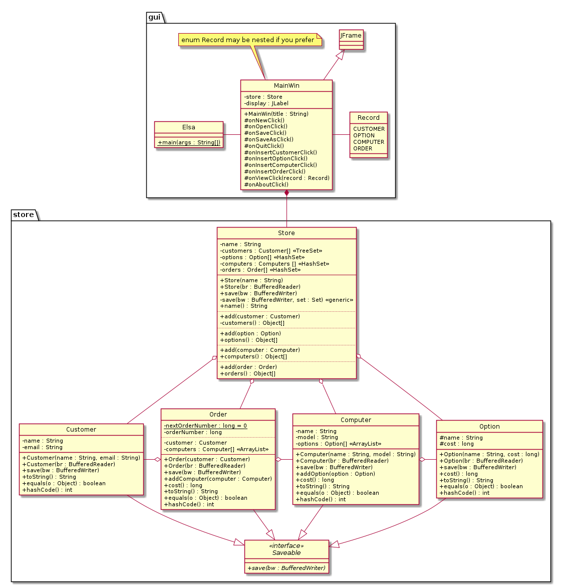
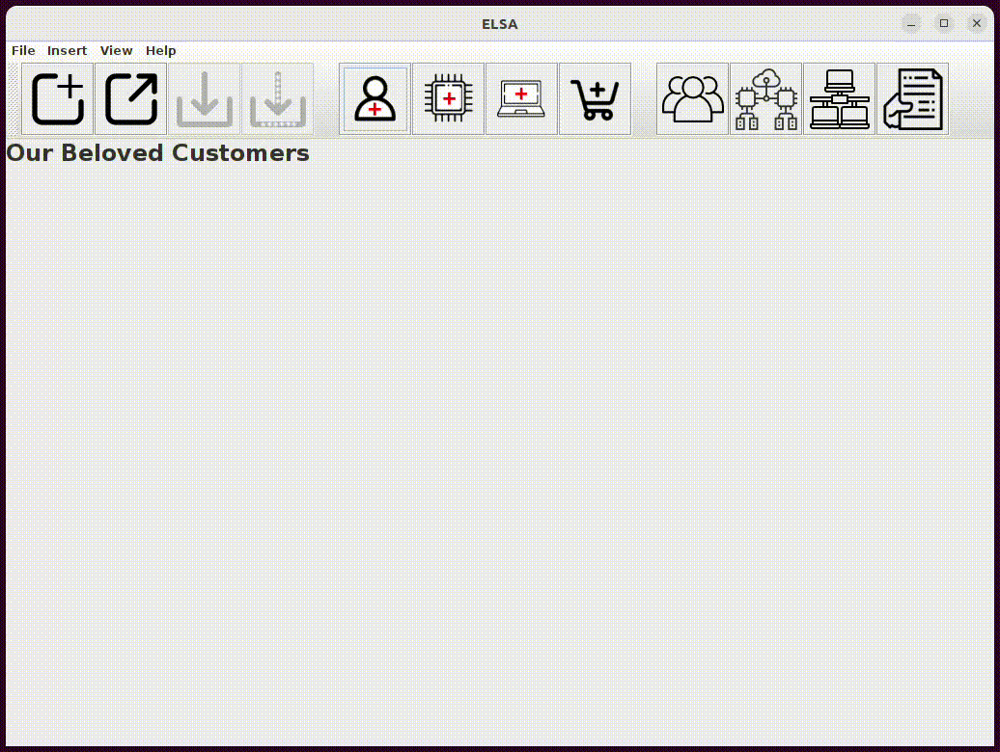

# ELSA - _(Exceptional Laptops and Supercomputers Always)_

I created as a part of my class project. ELSA is a store management program built using Java and the Java Swing (JSwing) library. It provides a user-friendly graphical user interface (GUI) for managing computer options components, setting prices, creating custom computers, and keeping track of orders.

## Requirements
To run ELSA, ensure that you have the following dependencies installed:
- **Java Development Kit (JDK) 11 or higher:** ELSA is built using OpenJDK 11.
- **Apache Ant:** ELSA utilizes Apache Ant as a build tool.

## How to run
Please make sure your machine has all the dependencies mentioned in the "Requirements" section.\
After cloning the repo, enter into the ELSA directory where we have the build.xml file. Run the following commands in the terminal:  

**To compile:** 
```$ ant```  
**To run (after compilation is complete):**
```$ java gui.Elsa```

## Features
- **Computer Options Components Management:** ELSA allows you to add and manage various computer options components, such as processors, graphics cards, memory modules, storage devices, and more. You can add new components, update their specifications, and remove components as needed.

- **Pricing Management:** With ELSA, you can set prices for each computer options component. The program provides an interface to easily update prices, ensuring accurate and up-to-date pricing information.

- **Custom Computer Creation:** ELSA enables users to create custom computers by selecting and combining different computer options components. The program guides users through the process, allowing them to choose components based on their preferences and requirements.

- **Order Tracking:** ELSA keeps track of the orders placed by customers. It records the details of each order, including the components selected, quantities, total price, and customer information. This feature allows for efficient order management and retrieval of order history.



## Demo


## License
ELSA is released under the GNU General Public License (GPL) version 3.0.

I would also like to extend my sincere thanks to Professor Rice for their invaluable guidance and support throughout the development process. Their expertise and feedback were instrumental in creating this program.
